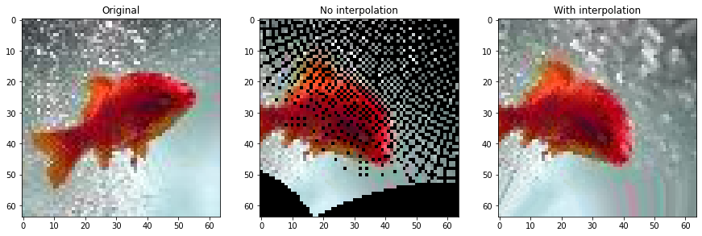
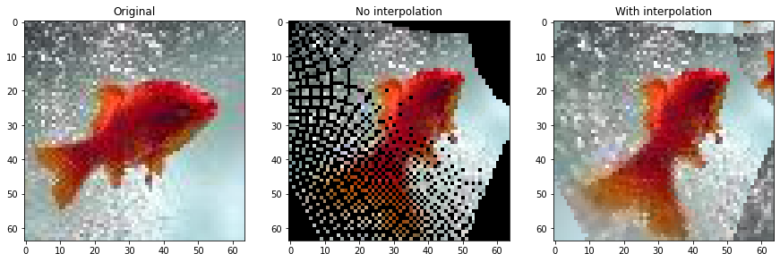
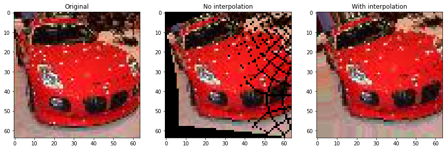
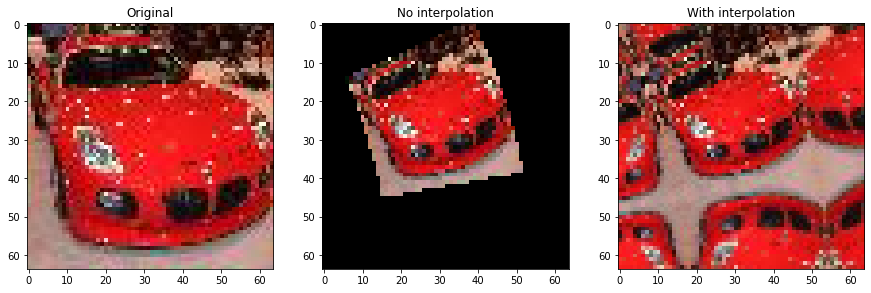

# Mobius_Demo
Demonstration for Mobius transformations on images

This method is used in paper Data augmentation with Mobius transformations
https://arxiv.org/abs/2002.02917

Examples output: 

Change the filename in Mobius_demo.ipynb and you will be able to mobius-transform your images! :)
